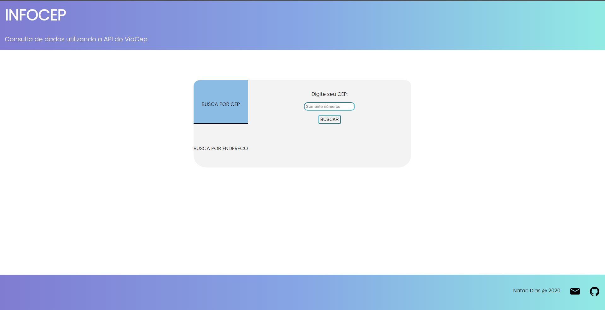
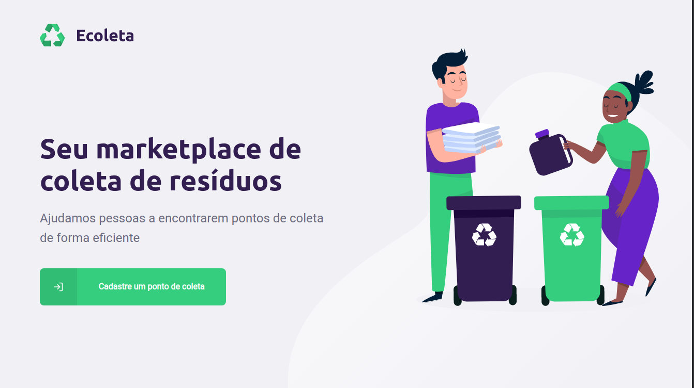

## Here are some of the projects that I've worked with:

* **Sorveteria Frutos de Minas**  
An ecommerce application made as a college work, using technologies like VueJS and Node  
[Available demo](https://frontend-sorveteria.herokuapp.com/)

* **InfoCEP**  
A simple web application designed to consume [ViaCep](https://viacep.com.br/) API and
get info about street codes, made with only HTML, CSS and Javascript   
[Code](https://github.com/natandias/INFOCEP)  
[Available demo](https://natandias.github.io/INFOCEP/)

* **Ecoleta**  
Application built during the "Next Level Week" from Rocketseat.  
The main objective of this application is to connect people to organizations that collect all kinds of recyclable wastes.  
[Code](https://github.com/natandias/NLW-01)  

* **Proffy**  
Application built during the "Next Level Week 2" from Rocketseat.  
This application aims to help students find a teacher that suits their needs and to make teachers able to monetize themselves and connect to new students.  
[Code](https://github.com/natandias/NLW-01)  
